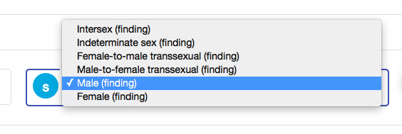
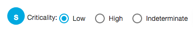
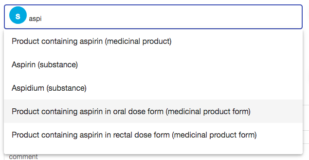
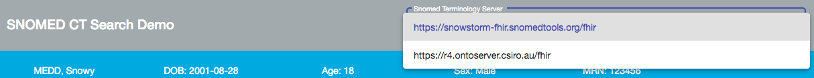
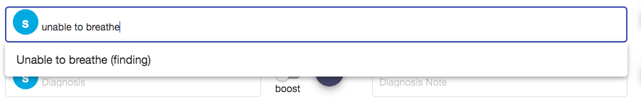
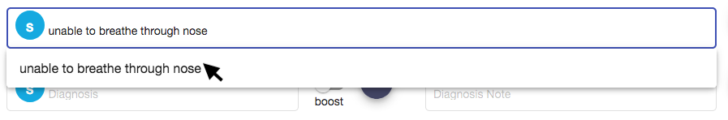
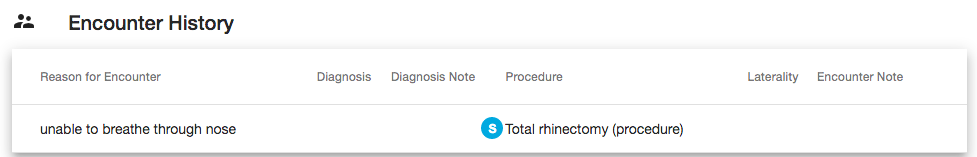

# Appendix A: Pointers for Demonstrating functionality

# Demonstrating SNOMED CT in different fields

SNOMED CT can be embedded into a UI in various ways

**Drop down**

In the &quot;Patient details&quot; section, the &quot;Sex&quot; field is a prepopulated drop-down field.

 

**Tick boxes**

In the &quot;Patient details&quot; section, the &quot;Smoker type&quot; field are SNOMED CT tick boxes, allowing selection of more than one answer.

 

**Radio buttons**

In the &quot;Allergies/Adverse Reactions&quot; section, the &quot;Criticality&quot; field are SNOMED CT radio buttons, which will allow the selection of only one answer.

 

**Combination search drop down**

In the &quot;Allergies/Adverse Reactions&quot; section, the &quot;Substance&quot; field is a combination search drop down field. It allows the user to begin typing and search returns in the drop down. The more letters the user searches, the more specific the search returns.

 

# Demonstrating basic search entry and functionality

Searching using words, part words or multiple part words

**Searching using a whole word – &quot;migraine&quot;**

1. Using the Snomed Terminology Server drop down, select the [https://snowstorm-fhir.snomedtools.org.fhir](https://snowstorm-fhir.snomedtools.org.fhir/) option

 

1. Select the &quot;Encounter&quot; section of the Demonstrator
2. Select the &quot;Diagnosis&quot; field and enter &quot;migraine&quot;

📌 Note that &quot;Migraine (disorder)&quot; is the first result returned. The following results are more specific types of migraine, you can scroll down to see other more. The search results are limited to the top 20 for usability.

**Searching using multiple words – &quot;migraine aura&quot;**

If the user wishes to find a specific term to record a diagnosis of a migraine with an aura

1. Select the &quot;Encounter&quot; section of the Demonstrator
2. Select the &quot;Diagnosis&quot; field and enter &quot;migraine aura&quot;

📌 Note that the results returned now are matches of any terms that have both the word migraine and aura in it. Word order is not important, so searching &quot;aura migraine&quot; will return the same result.

**Searching using part words (multiple prefixes) – &quot;atr fib&quot;**

1. Select the &quot;Encounter&quot; section of the Demonstrator
2. Select the &quot;Diagnosis&quot; field and enter &quot;atr fib&quot;

📌 Note that &quot;Atrial fibrillation (disorder) is the first result. The terminology server is able to search across multiple prefixes. This means that you can start to enter the beginning of multiple words separated by a space and the terminology server will return results that contain synonyms that contain all of them. It is only able to search prefixes (the beginning of the word), so searching &quot;atr&quot; will **not** return &quot;Feeling hatred (finding) as &quot;atr&quot; is not a prefix in the word &quot;hatred&quot;. Order is not dependent so searching &quot;fib atr&quot; will return the same result as &quot;atr fib&quot;

**Searching using repeated prefixes – &quot;pne pne&quot;**

Many search ranking algorithms ignore repeated search terms, but repeated terms carry a valuable signal.

1. Select the &quot;Diagnosis&quot; field and enter &quot;pne&quot;
2. Continue typing to enter &quot;pne pne&quot;
3. Compare the results of the two searches with Snowstorm and Ontoserver

Searching across all synonyms

**Searching using common acronym of IBD**

1. Using the Snomed Terminology Server drop down, select the [https://snowstorm-fhir.snomedtools.org.fhir](https://snowstorm-fhir.snomedtools.org.fhir/) option
2. Select the &quot;Encounter&quot; section of the Demonstrator
3. Select the &quot;Diagnosis&quot; field and enter &quot;ibd&quot;

📌 Note &quot;IBD&quot; is a common acronym from Inflammatory bowel disease and so the concept |Inflammatory bowel disease (disorder)| has a synonym of |IBD - Inflammatory bowel disease|. The terminology server is searching against all synonyms associated with concepts, and so searching the common acronym will return the desired search result.

Using free-text when no appropriate SNOMED CT concept is available

1. Using the Snomed Terminology Server drop down, select the [https://snowstorm-fhir.snomedtools.org.fhir](https://snowstorm-fhir.snomedtools.org.fhir/) option
2. Select the &quot;Reason for Encounter&quot; field in the &quot;Encounter&quot; section of the Demonstrator
3. Enter &quot;unable to breathe through nose&quot; in the &quot;Reason for Encounter&quot; field.

📌 Note that there is no SNOMED CT code that is that specific. As the user types, the drop down will return concepts that match, until no match is found. It will then allow free text.

 

 

1. Select the free text term from the drop down (user needs to click the words in the drop down to select it)

📌 Note that when you save the Encounter into the Encounter History, items that have a SNOMED CT code will have a blue S icon next to them. Those that are free text will not have a blue S icon; this is to illustrate what is happening behind the scenes in the structured record, not necessarily a suggestion that the UI needs visually distinguish coded and uncoded items.

 

# Demonstrating search behaviour using different terminology servers

**Searching using Snowstorm terminology server – &quot;gord&quot;**

1. Using the Snowstorm terminology server drop down, select the [https://snowstorm-fhir.snomedtools.org.fhir](https://snowstorm-fhir.snomedtools.org.fhir/) option
2. Select the &quot;Encounter&quot; section of the Demonstrator
3. Select the &quot;Diagnosis&quot; field and enter &quot;gord&quot;

📌 Note that &quot;GORD&quot; is a common acronym for &quot;gastroesophagesal reflux disease&quot;. The Snowstorm terminology server has searched all the associated descriptions of the SNOMED CT concepts. &quot;Gastroesophageal reflux disease (disorder) returns as third on the list in the drop down. This is because the Snostorm server returns the results in the order of shortest match and the first two matches contain synonyms that have a prefix of &quot;gord&quot; I.e. &quot;Palmoplantar keratoderma, spastic paralysis syndrome (disorder)&quot; has a synonym (Powell Venencie Gordon syndrome).

**Searching using Ontoserver terminology server – &quot;gord&quot;**

1. To change the terminology server, using the Snomed Terminology Server drop down, select the &quot;[https://r4.ontoserver.csiro.au/fhir](https://r4.ontoserver.csiro.au/fhir) option
2. Select the &quot;Diagnosis&quot; field on the &quot;Encounter&quot; page and enter &quot;gord&quot;

📌 Note that the Ontoserver terminology server has searched all the associated descriptions but has returned &quot;Gastroesophageal reflux disease&quot; as the first match. Some terminology servers can recognise acronyms and will weigh them higher in the search algorithm.

# Demonstrating description display using different terminology servers

**Search display using Snowstorm terminology server – &quot;acute COPD&quot;**

1. Using the Snomed Terminology Server drop down, select the [https://snowstorm-fhir.snomedtools.org.fhir](https://snowstorm-fhir.snomedtools.org.fhir/) option
2. Select the &quot;Encounter&quot; section of the Demonstrator
3. Select the &quot;Diagnosis&quot; field and enter &quot;acute COPD&quot;

📌 Note that the Snowstorm terminology server has returned FSNs

**Search display using Ontoserver terminology server – &quot;acute COPD&quot;**

1. To change the terminology server, using the Snomed Terminology Server drop down, select the &quot;[https://r4.ontoserver.csiro.au/fhir](https://r4.ontoserver.csiro.au/fhir) option
2. Select the &quot;Diagnosis&quot; field on the &quot;Encounter&quot; page and enter &quot;acute copd&quot;

📌 Note that the Ontoserver terminology server has returned the Preferred Terms

# Boost search functionality

The Demonstrator contains a &quot;boost functionality&quot; which allows preselected terms to be presented to the user first, before other less useful terms. These preselected terms can be a favourite list or based on frequency or any other list.

**Search for &quot;Type 1 diabetes mellitus&quot; without boosting**

1. Using the Snomed Terminology Server drop down, select the [https://snowstorm-fhir.snomedtools.org.fhir](https://snowstorm-fhir.snomedtools.org.fhir/) option
2. Select the &quot;Encounter&quot; section of the Demonstrator.
3. Ensure that the &quot;boost&quot; toggle is off (circle will be white and on the left side). If it is on, click on it so the circle moves to the left.

 

1. Select the Diagnosis field and enter the term &quot;diab&quot;

📌 Note that Type 1 diabetes mellitus is not in the drop down list as the search returns only the top 20 matches

**Search for &quot;Type 1 diabetes mellitus&quot; with boosting**

1. Click on the boost toggle to turn the boost functionality on (circle should be blue and on the right)

 

1. Select the Diagnosis field, it should still contain the term &quot;diab&quot; previously entered
2. Remove the letter &quot;b&quot; so that only the term &quot;dia&quot; is in field to trigger the search

📌 Note that Type 1 diabetes mellitus is the 2nd result returned.

# Prepopulating fields using SNOMED CT model

**Using procedure site from a procedure to prefill a laterality field**

1. Using the Snomed Terminology Server drop down, select the [https://snowstorm-fhir.snomedtools.org.fhir](https://snowstorm-fhir.snomedtools.org.fhir/) option
2. Select the &quot;Encounter&quot; section of the Demonstrator
3. Select the &quot;Procedure&quot; field and enter the term &quot;mastectomy&quot; and select &quot;Simple mastectomy (procedure)&quot; from the drop down list.

📌Note that you can select &quot;Left&quot;, &quot;Right&quot; or &quot;Right and left&quot; in the &quot;Laterality&quot; field.

1. Select the &quot;Procedure&quot; field again and enter &quot;left mast&quot; and select &quot;Mastectomy of left breast (procedure) from the drop down list.

📌Note that the &quot;Laterality&quot; field has now been prepopulated with &quot;Left (qualifier value)&quot; and has been greyed out and cannot be overridden.

1. Select the &quot;Procedure&quot; field again and enter &quot;remov war&quot; and select &quot;Removal of wart (procedure)&quot; from the drop down list.

📌Note that the &quot;Laterality&quot; field has been greyed out and cannot be used as this concept does not have a body structure that can be lateralised.

1. Select the &quot;Procedure&quot; field again and enter &quot;rhinec&quot; and select &quot;Total rhinectomy (procedure)&quot; from the drop down list

📌Note that the &quot;Laterality&quot; field is now greyed out as &quot;Total rhinectomy (procedure)&quot; is modelled with a procedure site that is not a member of the &quot;Lateralisable body structure reference set&quot; and so cannot be qualified with a laterality.

